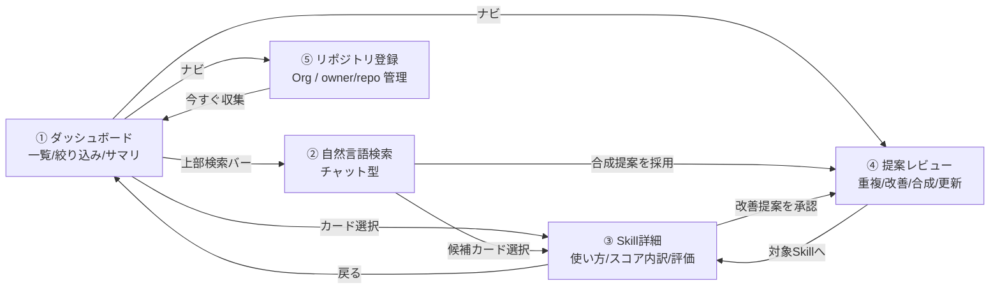
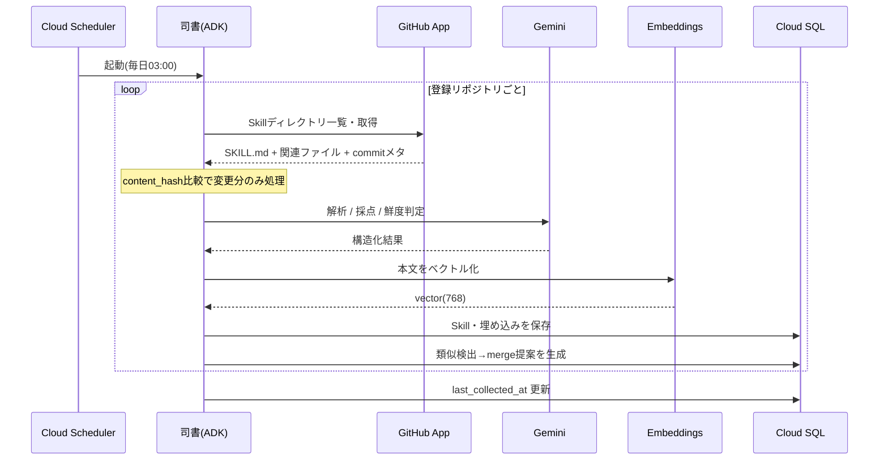
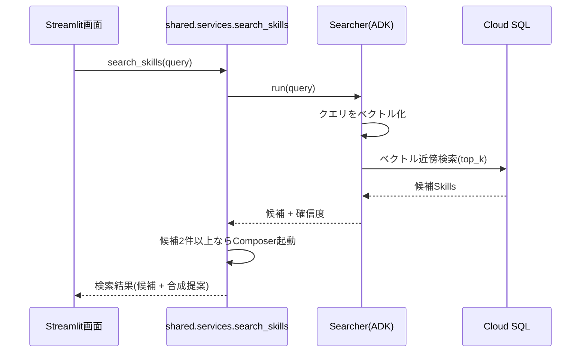
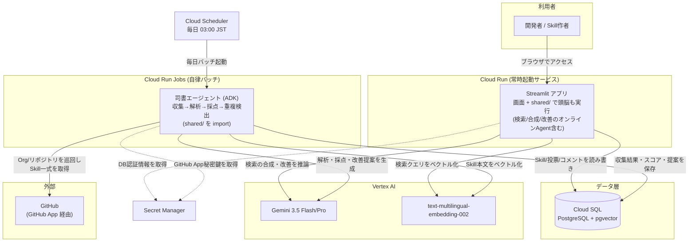
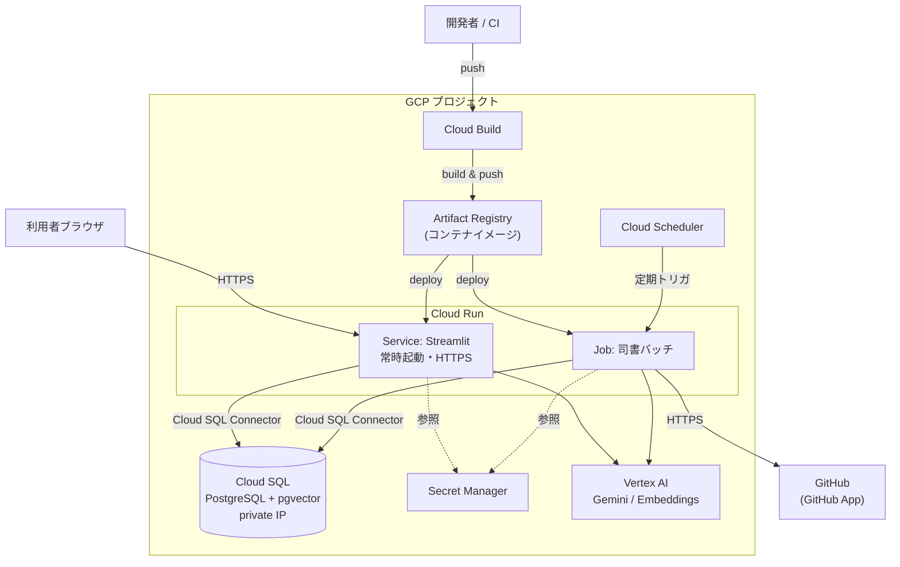
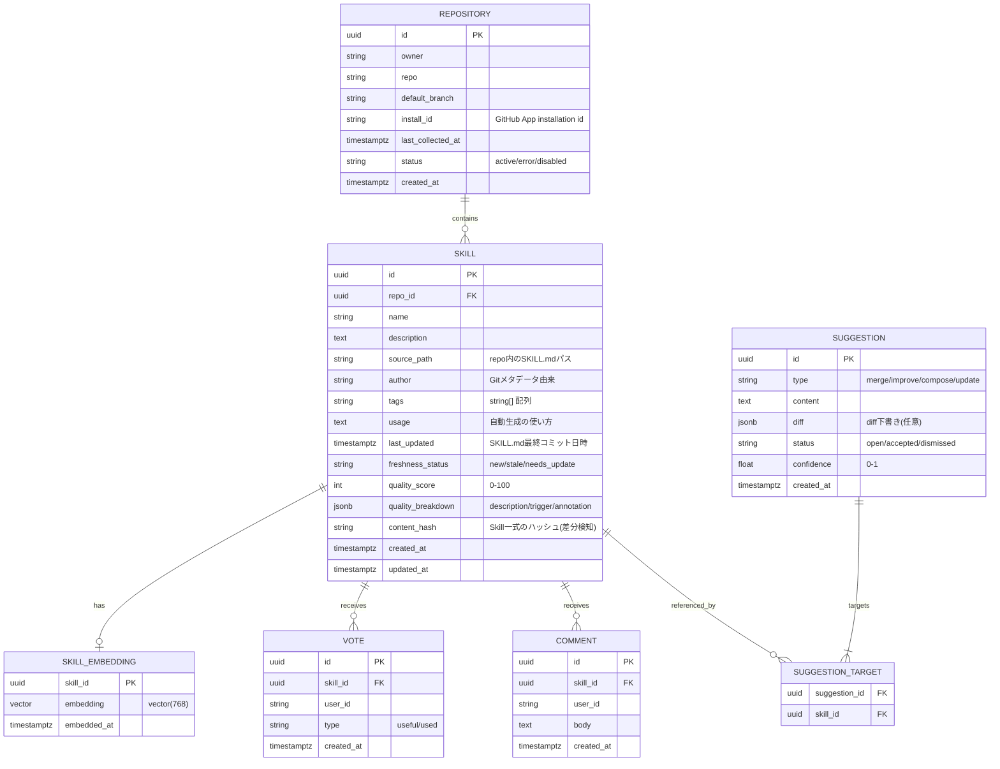
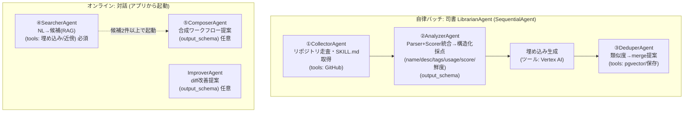
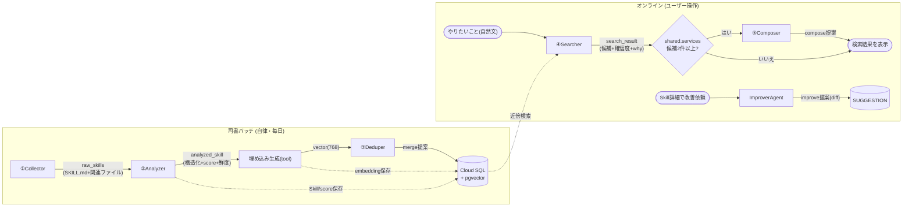

# SkillsHub 設計書

## 概要

SkillsHub は、社内に散らばっている AIエージェント用の Skill（`SKILL.md` と、それが参照するスクリプトや関連ファイル一式）を一箇所に集めて検索可能にし、品質と鮮度を継続的にチェックする社内向けダッシュボードである。

中核となるのが司書エージェントで、登録された GitHub の Organization やリポジトリを定期的に自動巡回し、Skill の収集・解析・タグ付け・品質採点・重複検出・改善提案を行う。ユーザー操作を起点とせず、定期実行でカタログを自動的に最新化する点が特徴である（「司書」は本書で一貫してこの収集エージェントを指す）。

利用者の主な操作は次の2つ。

- 開発者: 「やりたいこと」を自然文で入力すると、合致する Skill と使い方が提示される。投票・コメントで評価を残せる。
- Skill の作者: 作成前に既存の重複を確認でき、公開後は品質・鮮度の指摘と改善 diff を受け取れる。

本書は [README.md](README.md)（PRD）を実装レベルに具体化した設計書であり、課題・価値・ユーザーストーリーの詳細は PRD を参照する。

---

## 全体の流れ

ユーザーが触る画面の遷移と、システム内部の主要な処理シーケンスを先に示す。各コンポーネントやデータ構造の詳細は以降の章で説明する。

### 画面遷移



### 主要フロー（シーケンス）

司書による収集（バッチ・自動実行）



自然言語検索（ユーザー操作）



---

## 技術スタック候補

| レイヤー | 採用技術 | 用途（なぜ使うか） | 備考 |
|---|---|---|---|
| フロントエンド兼アプリ本体 | Streamlit | 一覧・検索・詳細・提案レビューの画面を Python だけで素早く作る。画面と処理を同一プロセスに同居させ構成を最小化 | Python界で最メジャー |
| 共通ロジック | `shared/` Pythonモジュール | DB・AI・GitHub の処理を1か所に集約し、画面と司書バッチで重複なく共有する | HTTP API（FastAPI）は立てず `import` で共有 |
| AIエージェント | Google ADK（Python, `google-adk`） | 収集・採点・重複検出・検索・提案を担うマルチエージェントの土台。ハッカソン必須のGoogle AI技術を充足 | 必須要件②を充足 |
| LLM | Gemini 3.5 Flash（既定）/ 重い推論は Pro 系 | SKILL.md の解析、品質採点、改善提案・合成提案の生成、検索結果の要約 | Vertex AI 経由。モデルIDは最新世代に追従 |
| 埋め込み | Vertex AI `text-multilingual-embedding-002`（768次元） | Skill 本文と検索クエリをベクトル化し、重複検出と意味検索に使う | 日英混在に対応する多言語モデル |
| データ基盤 | Cloud SQL for PostgreSQL + pgvector | Skill・投票・コメント・提案の永続化と、ベクトル類似検索を1つのDBで完結させる | 通常データとベクトルを一本化 |
| 実行基盤 | Cloud Run（Streamlit）＋ Cloud Run Jobs（司書バッチ） | 画面はリクエスト課金のサービスで、司書は定期起動のジョブで動かす。サーバー管理不要。ハッカソン必須のGCP実行基盤を充足 | 必須要件①を充足。デプロイ単位は2つ |
| スケジューラ | Cloud Scheduler | 人手なしで司書バッチを定期起動し、自律的な収集ループを成立させる | 自律性の起点 |
| シークレット | Secret Manager | GitHub App の秘密鍵や DB 認証情報をコード外で安全に管理する | 最小権限で参照 |
| 収集元 | GitHub（GitHub App / 登録制） | 登録した Organization 配下の全リポジトリ、または個別 `owner/repo` の `SKILL.md` を走査して収集する | 最小権限の読み取り専用 |

設計上のポイント（審査基準①「エージェントの必然性」）: 主要な処理は司書エージェントが自律的に担う。Cloud Scheduler が定期的に司書を起動し、収集→解析→採点→鮮度判定→重複検出→改善提案を自動実行する。ユーザー操作を起点としない自律ループが中心機能である。

---

## システム構成

全体は2種類の処理で動く。

1. 定期実行のバッチ収集: Cloud Scheduler が毎日決まった時刻に司書バッチ（Cloud Run Jobs）を起動する。司書は GitHub App 経由で登録 Organization / リポジトリを巡回し、`SKILL.md` とそれが参照するスクリプト・関連ファイル一式を取得して、Gemini で解析・採点・改善提案を行い、Vertex AI で本文をベクトル化し、結果（Skill 情報・スコア・提案）を Cloud SQL に保存する。ユーザー操作は不要。
2. ユーザー操作への応答: 利用者はブラウザから Streamlit アプリにアクセスする。一覧・詳細・投票は Cloud SQL を読み書きするだけだが、自然言語検索ではクエリを Vertex AI でベクトル化して近傍検索し、必要に応じて Gemini で合成・改善提案を生成する。

司書バッチと Streamlit は同じ `shared/` モジュールを共有し、鍵類は Secret Manager から取得する。



> Streamlitとバッチは同じ `shared/` モジュール（DB・AI・GitHub処理）を `import` して使う。両者の間にHTTP API（FastAPI）は置かない。デプロイ対象は「Streamlitサービス」と「司書Job」の2つだけ。

### コンポーネント責務

| コンポーネント | 責務 |
|---|---|
| Streamlit アプリ | 画面描画・ユーザー操作に加え、`shared/` を呼んでDB CRUDとオンライン系エージェント（検索/合成/改善）を同プロセスで実行 |
| `shared/` モジュール | DB・AI・GitHub処理を集約した共通ロジック。StreamlitとバッチがHTTPを介さず直接 `import` |
| 司書バッチ（Cloud Run Jobs） | 自律収集・解析・採点・鮮度判定・重複検出・提案生成（`shared/` を利用） |
| Cloud Scheduler | 司書バッチの定期トリガ（＝自律ループの起点） |
| Cloud SQL + pgvector | Skills本体・埋め込み・投票・コメント・提案の永続化 |
| Vertex AI | LLM推論（Gemini）と埋め込み生成 |
| GitHub App | 登録リポジトリへの最小権限アクセス |
| Secret Manager | 鍵・認証情報の集中管理 |

### インフラ構成（デプロイ）

GCP上のリソース配置とデプロイ経路を示す。アプリは Cloud Run のサービス（Streamlit）とジョブ（司書）として動き、両者が Cloud SQL・Vertex AI・Secret Manager を利用する。



> 将来拡張: 外部クライアント（モバイル等）や他システム連携が必要になったら、`shared/` をそのまま包む形でFastAPIのHTTP APIを追加できる（疎結合を保つ設計）。本ハッカソンでは不要なため立てない。

---

## 画面・導線

画面遷移の全体像は「全体の流れ」を参照。ここでは各画面の中身を定義する。

### 各画面の仕様

#### ダッシュボード（一覧）`pages/dashboard.py`
- 上部エージェントバー: 「やりたいこと」を自然文入力 → 検索画面へ遷移し検索実行。
- サマリカード（4枚）: 登録Skills数 / 重複候補数 / 要更新数 / 陳腐化注意数。`shared.services.get_summary()` から取得。
- 絞り込みツールバー: フリーワード、鮮度（new/stale/needs_update）、タグ、ソート（品質/更新日/投票）。
- Skillカードグリッド: 鮮度バッジ・品質スコア・タグ・作者・👍数・💬数・取得元リンク。クリックで詳細へ。
- 導線: カード→詳細、検索バー→検索、ナビ→提案レビュー／リポジトリ登録。

#### 自然言語検索（チャット）`pages/search.py`
- チャットUI。ユーザー発話→エージェントが「解析中／横断検索中／品質照合中」の途中表示→候補（最大3件）を確信度付きで提示。
- 候補が2件以上なら合成ワークフロー提案を併記（例: 議事録要約 → タスク抽出）。
- 各候補に推薦理由（why）を表示。候補カード→詳細、合成提案「採用」→提案レビューに Suggestion 登録。

#### Skill詳細 `pages/detail.py`
- ヘッダ: 鮮度バッジ・品質スコア・タグ・説明・作者・取得元（GitHubリンク）・最終更新。
- 使い方（自動生成）: エージェント生成の利用例。
- 品質スコア内訳: 説明の明確さ / トリガー精度 / 注釈の充実（各バー表示）。
- 改善提案: 対象Skillに紐づく open な Suggestion（diff下書き含む）。承認/却下可。
- 評価: 👍役に立った / ✓使った ボタン、コメント一覧＋投稿。

#### 提案レビュー `pages/suggestions.py`
- open な Suggestion 一覧（type別バッジ: merge/improve/compose/update）。
- 対象Skillリンク、提案本文、diff（あれば）、採用/却下ボタン。
- 採用時の挙動はアルゴリズム仕様の「提案の採用時挙動」を参照。

#### リポジトリ登録 `pages/repos.py`
- 登録済み一覧（Organization または `owner/repo`、最終収集日時・収集Skill数・状態）。
- 新規登録フォーム: Organization 単位（配下の全アクセス可能リポジトリを対象）／個別 `owner/repo`、ブランチ任意。
- 「今すぐ収集」ボタンで当該対象の収集を即時キック（`shared.services.collect_repo(repo_id)`）。

### 状態管理（Streamlit）
- `st.session_state` に `current_view` / `selected_skill_id` / `chat_history` / `filters` を保持。
- 各画面は `shared/` のサービス関数を呼ぶだけで、データの真実はDB側に置く（UIはステートレス寄り）。

---

## データモデル

### ER図



> PRDのデータモデルからの差分: `Repository` を追加（登録制収集の単位）、`Skill.usage/quality_breakdown/content_hash` を追加、`Suggestion` の多対多をブリッジ表 `suggestion_target` で表現（compose型が複数Skillを参照するため）。

## ADKエージェント設計

### エージェント構成

実装するエージェントは **5体（＋司書オーケストレータ）** に絞る。設計上の論点だった `Parser` と `Scorer` は1回のLLM呼び出しに統合して `AnalyzerAgent` とし（呼び出し回数とコストを削減）、`FreshnessAgent` は当面 Analyzer 内の仮判定＋日付ルールで代替して独立させない（必要になれば後から分離できる構成）。



- オフライン司書は `SequentialAgent`（`Collector → Analyzer → Dedup`）。Collectorのリポジトリごとに Analyzer はリポジトリ内Skill単位で `LoopAgent`/並列化可。
- **ADKの制約**: `output_schema` を設定したエージェントは tools を使えない。そのため「構造化出力が要るもの（Analyzer/Composer/Improver）」と「ツールを叩くもの（Collector/Dedup/Searcher）」で役割を分けている。
- 各エージェントは結果を `output_key` で session state に書き、後段がそれを読む契約とする（構造化出力は `output_schema` / Pydantic で固定）。
- オンラインはアプリのリクエスト時に該当エージェントを `Runner` で起動。合成は Searcher→Composer を機械的に直列化せず、`shared.services` が検索候補を見て必要時に Composer を呼ぶ（Composer は構造化出力で tools を持てないため、制御をサービス層に置くと素直）。
- モデルは Gemini Flash 既定、重い推論（Composer/Improver）のみ Pro 系を使い分け。
- 収集の処理シーケンスは「全体の流れ」を参照。

### Agentの流れ（データの受け渡し）

各エージェントが session state（`output_key`）を介してどうバトンを渡すかを示す。オフライン司書はリポジトリ→Skill単位で②③をループし、オンラインはユーザー操作起点で④⑤を起動する。



- 司書側は「収集→解析→埋め込み→重複検出」を Skill ごとに繰り返し、結果は逐次 Cloud SQL に永続化する（1件失敗しても他Skillは止めない）。
- オンライン側は `output_key`（`search_result` 等）をサービス層が受け取り、分岐や提案登録を制御する。
- 提案（merge/compose/improve）は `SUGGESTION` に貯まり、提案レビュー画面で採用/却下する。

---

## ⭐ アルゴリズム仕様（重点討議ポイント）

> 💬 この章は今後詰めたい論点。特に **品質スコアの決め方（評価観点・重み・算出式）**、鮮度判定のしきい値、重複検出のしきい値は現時点では暫定値であり、実データを見ながら調整する前提。スコアの納得感はユーザーの信頼に直結するため、優先して検討したい。

### 品質スコア（0-100）
LLM（Scorer）が3観点を各0-100で採点し、加重平均で総合スコアを出す。
- 説明の明確さ `description`（重み0.4）: 何をするSkillか一読で分かるか。
- トリガー精度 `trigger`（重み0.35）: 「いつ使うか」の記述が具体的か。
- 注釈の充実 `annotation`（重み0.25）: 入出力例・前提・制約の記載。
- `quality_score = round(0.40*d + 0.35*t + 0.25*a)`。内訳は `quality_breakdown` に保存し詳細画面で可視化。
- ※ 評価観点・重み・算出式はいずれも暫定。実 Skill で検証して決め方を詰める。

### 鮮度判定
| ステータス | 条件 |
|---|---|
| `new` | 最終更新が90日以内、かつ依存変更の兆候なし |
| `stale` | 最終更新が90日超〜180日、または依存記述が古い疑い |
| `needs_update` | 参照API/依存ツールの変更を検知（FreshnessAgentがSKILL.md内の参照先と既知の変更を突き合わせ） |
- しきい値（90/180日）は環境変数で調整可能にする。

### 重複・類似検出
- pgvector cosine 類似度で近傍探索。`similarity = 1 - cosine_distance`。
- しきい値 0.88以上 を重複候補とし、`merge` 提案を生成（過検出回避のため高めに設定、環境変数化）。
- 自分自身・同一 `source_path` は除外。

### 提案の採用時挙動
- `merge`/`improve`/`compose`: ステータスを `accepted` に更新（ハッカソン版は記録のみ。GitHubへの自動PRは将来拡張）。
- `update`: diffを「適用済みドラフト」として記録し、対象Skillの `freshness_status` を `new` に戻す（実コミットは作者が手元で実施）。
- いずれも監査のため `accepted` 履歴を残す。

---

## GitHub App 連携

GitHub App を対象 Organization にインストールすることで、Org 全体を走査できる。個別 `owner/repo` だけを対象にしたい場合は、その Org 内で対象リポジトリのみにアクセスを絞ってインストールする（GitHub App は「全リポジトリ」または「選択したリポジトリ」を選べる）。

- 権限（最小）: `Contents: Read-only`、`Metadata: Read-only`。Org 単位のインストールで配下リポジトリへまとめてアクセス。
- 認証フロー: App秘密鍵（Secret Manager）→ JWT生成 → Org の Installation Access Token取得 → API呼び出し。`installation_id` は `repository.install_id` に保持。
- リポジトリ列挙（Org走査の起点）: `GET /installation/repositories` でインストールがアクセス可能な全リポジトリを取得し、登録対象としてループする。新規リポジトリの追加・削除も毎回の列挙で自動追従。
- Skill探索: 各リポジトリで Git Trees API（`recursive=1`）でツリー取得 → `SKILL.md`（大文字小文字許容）を見つけ、**その `SKILL.md` が置かれたディレクトリを1つの Skill 単位**とみなす。`SKILL.md` 本文に加え、同ディレクトリ配下のスクリプトや関連ファイル（`scripts/`・テンプレート・参照データ等）も Contents API で取得する。
- 作者/更新日: Commits API（Skillディレクトリの `path` を指定した最新コミット）から `author` と `last_commit_at` を取得。
- 差分検知: `content_hash`（`SKILL.md` ＋関連ファイル群をまとめたSHA-256）が前回と同一ならLLM処理をスキップ（コスト・レート対策）。
- レート対策: Org走査はリポジトリ数に比例して呼び出しが増えるため、ETag/Conditional Request、リポジトリ単位の指数バックオフ、並列度の上限設定を行う。失敗時は `repository.status='error'` にして他リポジトリの処理は止めない。

---

## 非機能要件

| 区分 | 方針 |
|---|---|
| 性能 | 一覧/詳細はDBインデックスで <300ms。検索はベクトル近傍＋LLM要約で数秒許容 |
| コスト | 差分検知でLLM呼び出し最小化。Gemini Flash既定、重い推論のみPro |
| セキュリティ | 鍵はSecret Manager集中管理。GitHub App最小権限。DBはプライベートIP＋Cloud SQL Connector |
| 可観測性 | Cloud Logging構造化ログ、バッチ実行結果（収集数/失敗数）を記録 |
| 信頼性 | バッチはリポジトリ単位で独立。1件失敗が全体を止めない |
| デプロイ | Cloud Build → Cloud Run / Cloud Run Jobs。IaCは任意（Terraform可） |
| 拡張性 | 収集元（org全走査・Slack/Notion）、自動PR、ギャップ分析を後付け可能な疎結合構成 |

---

## ディレクトリ構成（案）

```
skillhub/
├── app/                      # Streamlit（画面のみ。頭脳は shared/ を呼ぶ）
│   ├── main.py               # エントリ（Cloud Runサービス）
│   └── pages/{dashboard,search,detail,suggestions,repos}.py
├── shared/                   # 共通ロジック（画面・バッチが import）
│   ├── services.py           # サービス関数（アプリ内部API）
│   ├── schemas.py            # Pydanticモデル
│   ├── db.py                 # Cloud SQL接続・クエリ
│   ├── config.py             # 設定・Secret Manager読み込み
│   ├── agents/               # ADK
│   │   ├── librarian.py      # SequentialAgent（バッチ）
│   │   ├── online.py         # Searcher/Composer/Improver
│   │   └── prompts/
│   └── tools/                # FunctionTool 群
│       ├── github_tools.py
│       ├── db_tools.py
│       └── ai_tools.py
├── batch/
│   └── run_collect.py        # Cloud Run Jobs エントリ（shared.agents.librarian を実行）
├── db/
│   ├── ddl.sql
│   └── migrations/
├── tests/
├── Dockerfile.app            # Streamlitサービス用
├── Dockerfile.batch          # 司書Job用
└── README.md
```

> デプロイ対象は `Dockerfile.app`（Streamlit）と `Dockerfile.batch`（司書Job）の2つのみ。両イメージとも `shared/` を同梱する。

---

## 審査基準への対応

| 審査基準 | 本設計での対応 |
|---|---|
| ① エージェントの必然性（自律性） | Cloud Scheduler起点の司書バッチが人手なしで収集→採点→重複検出→提案を継続。主要機能をエージェントが担う |
| ② 課題へのアプローチ | Skillsの散在・重複・陳腐化という実在課題に、収集と評価で直接対応（PRD参照） |
| ③ ユーザビリティ | 自然言語検索、鮮度バッジ、ワンクリック投票、その場採用できるdiff提案 |
| ④ 実用性・体験価値 | 発見→利用→評価→改善が一画面で循環。合成提案で単体不足を補完 |
| ⑤ 実装力 | Google Cloud一貫（Cloud Run/SQL/Vertex/ADK）、疎結合で拡張余地明示、最小権限・差分検知など実運用配慮 |
