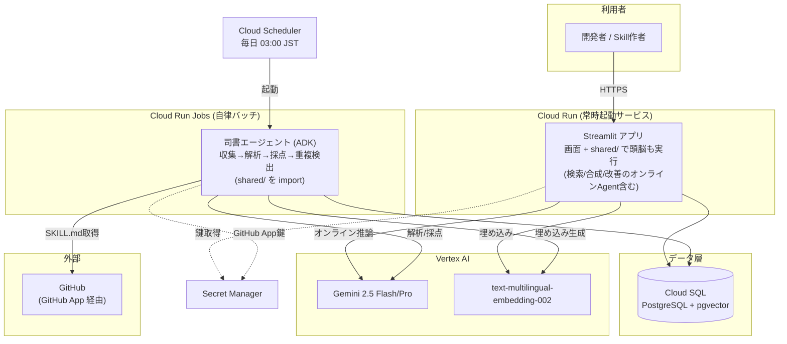
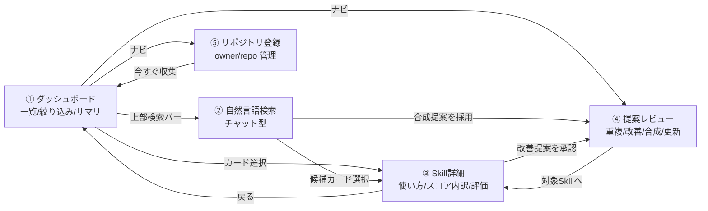
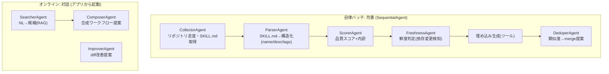
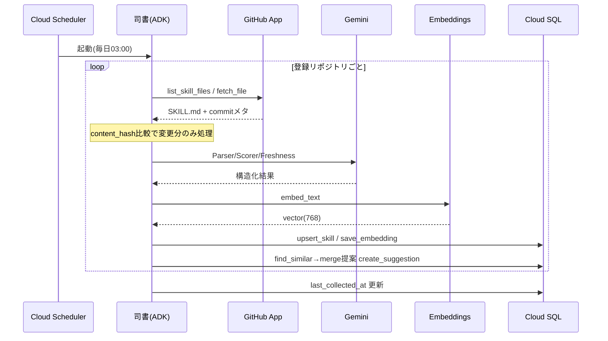
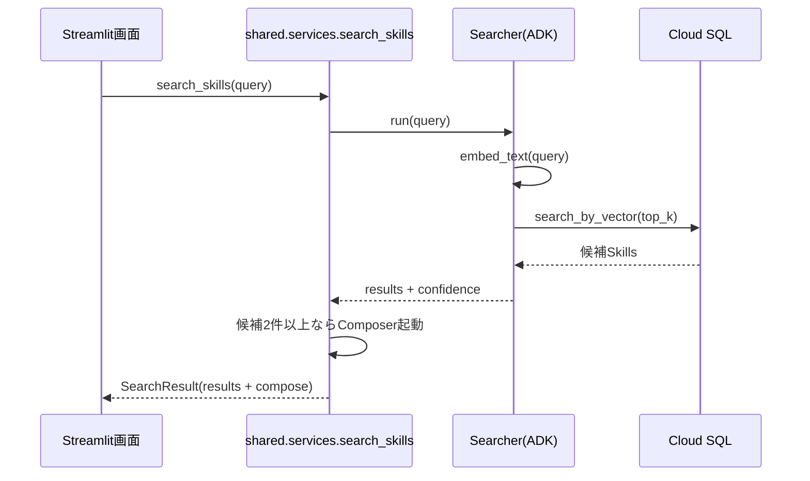

# SkillHub 設計書

対象ハッカソン: DevOps × AI Agent Hackathon 2026（主催 Findy / メインスポンサー Google Cloud）。提出物は公開GitHub / 動作するデプロイURL / ProtoPedia 登録。本書は [README.md](README.md)（PRD）を実装レベルに落とした設計書であり、PRDで定義済みの課題・価値・ユーザーストーリーは再掲しない。

---

## 確定スタックと前提

| レイヤー | 採用技術 | 備考 |
|---|---|---|
| フロントエンド兼アプリ本体 | Streamlit | Python界で最メジャー。画面＋頭脳（DB/AI処理）を同一プロセスで実行 |
| 共通ロジック | `shared/` Pythonモジュール | DB・AI・GitHub処理を集約。Streamlitと司書バッチが `import` して共有（HTTP APIは立てない） |
| AIエージェント | Google ADK（Python, `google-adk`） | 必須要件②を充足。マルチエージェント |
| LLM | Gemini 2.5 Flash（既定）/ Gemini 2.5 Pro（合成・改善などの重い推論） | Vertex AI 経由 |
| 埋め込み | Vertex AI `text-multilingual-embedding-002`（768次元） | 日英混在Skillsに対応 |
| データ基盤 | Cloud SQL for PostgreSQL + pgvector | 通常データとベクトル類似検索を一本化 |
| 実行基盤 | Cloud Run（Streamlitアプリ）＋ Cloud Run Jobs（自律バッチ司書） | 必須要件①を充足。デプロイ単位は2つだけ |
| スケジューラ | Cloud Scheduler | 司書バッチを定期起動（＝自律性の核） |
| シークレット | Secret Manager | GitHub App鍵・DB認証情報 |
| 収集元 | GitHub（GitHub App / リポジトリ登録制） | 登録された `owner/repo` 配下の `SKILL.md` を走査 |

設計の核（審査基準①「エージェントの必然性」）: ダッシュボードは器であり、価値は自律的に動く司書エージェントが生む。Cloud Scheduler が人手なしに司書を起動し、収集→解析→採点→鮮度判定→重複検出→改善提案を回し続ける。利用者の操作を起点にしない自律ループがプロダクトの背骨である。

---

## システム構成



> Streamlitとバッチは同じ `shared/` モジュール（DB・AI・GitHub処理）を `import` して使う。両者の間にHTTP API（FastAPI）は置かない。デプロイ対象は「Streamlitサービス」と「司書Job」の2つだけ。

### コンポーネント責務

| コンポーネント | 責務 |
|---|---|
| Streamlit アプリ | 画面描画・ユーザー操作に加え、`shared/` を呼んでDB CRUDとオンライン系エージェント（検索/合成/改善）を同プロセスで実行 |
| `shared/` モジュール | DB・AI・GitHub処理を集約した共通ロジック。StreamlitとバッチがHTTPを介さず直接 `import` |
| 司書バッチ（Cloud Run Jobs） | 自律収集・解析・採点・鮮度判定・重複検出・提案生成（`shared/` を利用） |
| Cloud Scheduler | 司書バッチの定期トリガ（＝自律ループの起点） |
| Cloud SQL + pgvector | Skills本体・埋め込み・投票・コメント・提案の永続化 |
| Vertex AI | LLM推論（Gemini）と埋め込み生成 |
| GitHub App | 登録リポジトリへの最小権限アクセス |
| Secret Manager | 鍵・認証情報の集中管理 |

> 将来拡張: 外部クライアント（モバイル等）や他システム連携が必要になったら、`shared/` をそのまま包む形でFastAPIのHTTP APIを追加できる（疎結合を保つ設計）。本ハッカソンでは不要なため立てない。

---

## 画面・導線

### 画面遷移



### 各画面の仕様

#### ダッシュボード（一覧）`pages/dashboard.py`
- 上部エージェントバー: 「やりたいこと」を自然文入力 → 検索画面へ遷移し検索実行。
- サマリカード（4枚）: 登録Skills数 / 重複候補数 / 要更新数 / 陳腐化注意数。`shared.services.get_summary()` から取得。
- 絞り込みツールバー: フリーワード、鮮度（fresh/stale/needs_update）、タグ、ソート（品質/更新日/投票）。
- Skillカードグリッド: 鮮度バッジ・品質スコア・タグ・作者・👍数・💬数・取得元リンク。クリックで詳細へ。
- 導線: カード→詳細、検索バー→検索、ナビ→提案レビュー／リポジトリ登録。

#### 自然言語検索（チャット）`pages/search.py`
- チャットUI。ユーザー発話→エージェントが「解析中／横断検索中／品質照合中」の途中表示→候補（最大3件）を確信度付きで提示。
- 候補が2件以上なら合成ワークフロー提案を併記（例: 議事録要約 → タスク抽出）。
- 各候補に推薦理由（why）を表示。候補カード→詳細、合成提案「採用」→提案レビューに Suggestion 登録。

#### Skill詳細 `pages/detail.py`
- ヘッダ: 鮮度バッジ・品質スコア・タグ・説明・作者・取得元（GitHubリンク）・最終更新。
- 使い方（自動生成）: エージェント生成の利用例。
- 品質スコア内訳: 説明の明確さ / トリガー精度 / 注釈の充実（各バー表示）。
- 改善提案: 対象Skillに紐づく open な Suggestion（diff下書き含む）。承認/却下可。
- 評価: 👍役に立った / ✓使った ボタン、コメント一覧＋投稿。

#### 提案レビュー `pages/suggestions.py`
- open な Suggestion 一覧（type別バッジ: merge/improve/compose/update）。
- 対象Skillリンク、提案本文、diff（あれば）、採用/却下ボタン。
- 採用時の挙動はアルゴリズム仕様の「提案の採用時挙動」を参照。

#### リポジトリ登録 `pages/repos.py`
- 登録済み `owner/repo` 一覧（最終収集日時・収集Skill数・状態）。
- 新規登録フォーム（owner/repo、ブランチ任意）。
- 「今すぐ収集」ボタンで当該リポジトリの収集を即時キック（`shared.services.collect_repo(repo_id)`）。

### 状態管理（Streamlit）
- `st.session_state` に `current_view` / `selected_skill_id` / `chat_history` / `filters` を保持。
- 各画面は `shared/` のサービス関数を呼ぶだけで、データの真実はDB側に置く（UIはステートレス寄り）。

---

## データモデル

### ER図

```mermaid
erDiagram
    REPOSITORY ||--o{ SKILL : contains
    SKILL ||--o| SKILL_EMBEDDING : has
    SKILL ||--o{ VOTE : receives
    SKILL ||--o{ COMMENT : receives
    SKILL ||--o{ SUGGESTION_TARGET : referenced_by
    SUGGESTION ||--|{ SUGGESTION_TARGET : targets

    REPOSITORY {
        uuid id PK
        string owner
        string repo
        string default_branch
        string install_id "GitHub App installation id"
        timestamptz last_collected_at
        string status "active/error/disabled"
        timestamptz created_at
    }
    SKILL {
        uuid id PK
        uuid repo_id FK
        string name
        text description
        string source_path "repo内のSKILL.mdパス"
        string author "Gitメタデータ由来"
        string[] tags
        text usage "自動生成の使い方"
        timestamptz last_updated "SKILL.md最終コミット日時"
        string freshness_status "fresh/stale/needs_update"
        int quality_score "0-100"
        jsonb quality_breakdown "description/trigger/annotation"
        string content_hash "本文ハッシュ(差分検知)"
        timestamptz created_at
        timestamptz updated_at
    }
    SKILL_EMBEDDING {
        uuid skill_id PK_FK
        vector embedding "vector(768)"
        timestamptz embedded_at
    }
    VOTE {
        uuid id PK
        uuid skill_id FK
        string user_id
        string type "useful/used"
        timestamptz created_at
    }
    COMMENT {
        uuid id PK
        uuid skill_id FK
        string user_id
        text body
        timestamptz created_at
    }
    SUGGESTION {
        uuid id PK
        string type "merge/improve/compose/update"
        text content
        jsonb diff "diff下書き(任意)"
        string status "open/accepted/dismissed"
        float confidence "0-1"
        timestamptz created_at
    }
    SUGGESTION_TARGET {
        uuid suggestion_id FK
        uuid skill_id FK
    }
```

> PRDのデータモデルからの差分: `Repository` を追加（登録制収集の単位）、`Skill.usage/quality_breakdown/content_hash` を追加、`Suggestion` の多対多をブリッジ表 `suggestion_target` で表現（compose型が複数Skillを参照するため）。

### DDL（PostgreSQL + pgvector）

```sql
CREATE EXTENSION IF NOT EXISTS vector;
CREATE EXTENSION IF NOT EXISTS "uuid-ossp";

CREATE TABLE repository (
    id              UUID PRIMARY KEY DEFAULT uuid_generate_v4(),
    owner           TEXT NOT NULL,
    repo            TEXT NOT NULL,
    default_branch  TEXT NOT NULL DEFAULT 'main',
    install_id      TEXT NOT NULL,
    last_collected_at TIMESTAMPTZ,
    status          TEXT NOT NULL DEFAULT 'active'
                    CHECK (status IN ('active','error','disabled')),
    created_at      TIMESTAMPTZ NOT NULL DEFAULT now(),
    UNIQUE (owner, repo)
);

CREATE TABLE skill (
    id                UUID PRIMARY KEY DEFAULT uuid_generate_v4(),
    repo_id           UUID NOT NULL REFERENCES repository(id) ON DELETE CASCADE,
    name              TEXT NOT NULL,
    description       TEXT NOT NULL,
    source_path       TEXT NOT NULL,
    author            TEXT,
    tags              TEXT[] NOT NULL DEFAULT '{}',
    usage             TEXT,
    last_updated      TIMESTAMPTZ,
    freshness_status  TEXT NOT NULL DEFAULT 'fresh'
                      CHECK (freshness_status IN ('fresh','stale','needs_update')),
    quality_score     INT NOT NULL DEFAULT 0 CHECK (quality_score BETWEEN 0 AND 100),
    quality_breakdown JSONB NOT NULL DEFAULT '{}',
    content_hash      TEXT NOT NULL,
    created_at        TIMESTAMPTZ NOT NULL DEFAULT now(),
    updated_at        TIMESTAMPTZ NOT NULL DEFAULT now(),
    UNIQUE (repo_id, source_path)
);
CREATE INDEX idx_skill_freshness ON skill(freshness_status);
CREATE INDEX idx_skill_tags ON skill USING GIN(tags);
CREATE INDEX idx_skill_score ON skill(quality_score DESC);

CREATE TABLE skill_embedding (
    skill_id    UUID PRIMARY KEY REFERENCES skill(id) ON DELETE CASCADE,
    embedding   VECTOR(768) NOT NULL,
    embedded_at TIMESTAMPTZ NOT NULL DEFAULT now()
);
-- 類似検索用 HNSW インデックス（cosine距離）
CREATE INDEX idx_skill_embedding_hnsw
    ON skill_embedding USING hnsw (embedding vector_cosine_ops);

CREATE TABLE vote (
    id         UUID PRIMARY KEY DEFAULT uuid_generate_v4(),
    skill_id   UUID NOT NULL REFERENCES skill(id) ON DELETE CASCADE,
    user_id    TEXT NOT NULL,
    type       TEXT NOT NULL CHECK (type IN ('useful','used')),
    created_at TIMESTAMPTZ NOT NULL DEFAULT now(),
    UNIQUE (skill_id, user_id, type)   -- 二重投票防止
);

CREATE TABLE comment (
    id         UUID PRIMARY KEY DEFAULT uuid_generate_v4(),
    skill_id   UUID NOT NULL REFERENCES skill(id) ON DELETE CASCADE,
    user_id    TEXT NOT NULL,
    body       TEXT NOT NULL,
    created_at TIMESTAMPTZ NOT NULL DEFAULT now()
);

CREATE TABLE suggestion (
    id         UUID PRIMARY KEY DEFAULT uuid_generate_v4(),
    type       TEXT NOT NULL CHECK (type IN ('merge','improve','compose','update')),
    content    TEXT NOT NULL,
    diff       JSONB,
    status     TEXT NOT NULL DEFAULT 'open'
               CHECK (status IN ('open','accepted','dismissed')),
    confidence REAL,
    created_at TIMESTAMPTZ NOT NULL DEFAULT now()
);

CREATE TABLE suggestion_target (
    suggestion_id UUID NOT NULL REFERENCES suggestion(id) ON DELETE CASCADE,
    skill_id      UUID NOT NULL REFERENCES skill(id) ON DELETE CASCADE,
    PRIMARY KEY (suggestion_id, skill_id)
);
```

---

## API（内部サービス層 I/F）

HTTP APIは立てず、`shared/services.py` のPython関数を「API＝アプリ内部の契約」とする。Streamlit画面と司書バッチはこの関数群を直接 `import` して呼ぶ。戻り値はPydanticモデル（`shared/schemas.py`）で型を保証する。

### サービス関数一覧

| 関数 | 概要 |
|---|---|
| `get_summary() -> Summary` | ダッシュボード上部の集計値 |
| `list_skills(filter: SkillFilter) -> Page[SkillCard]` | Skill一覧（絞り込み/ソート/ページング） |
| `get_skill(skill_id: str) -> SkillDetail` | Skill詳細（投票/コメント/提案を含む） |
| `add_vote(skill_id, user_id, type) -> VoteCount` | 投票（useful/used）。二重投票は無視 |
| `add_comment(skill_id, user_id, body) -> Comment` | コメント投稿 |
| `search_skills(query: str, top_k=3) -> SearchResult` | 自然言語検索（候補＋合成提案）。Searcher/Composer起動 |
| `list_suggestions(status='open') -> list[Suggestion]` | 提案一覧 |
| `resolve_suggestion(suggestion_id, action) -> Suggestion` | 提案の採用/却下（action: accepted/dismissed） |
| `list_repos() -> list[Repository]` | 登録リポジトリ一覧 |
| `register_repo(owner, repo, default_branch='main') -> Repository` | リポジトリ登録 |
| `collect_repo(repo_id: str) -> CollectResult` | 当該リポジトリの即時収集を実行 |
| `delete_repo(repo_id: str) -> None` | リポジトリ登録解除 |

### 主要スキーマ（Pydantic / `shared/schemas.py`）

```python
class Summary(BaseModel):
    total_skills: int; duplicate_candidates: int; needs_update: int; stale: int

class SkillFilter(BaseModel):
    q: str | None = None
    status: Literal["fresh","stale","needs_update"] | None = None
    tag: str | None = None
    sort: Literal["score","updated","votes"] = "score"
    page: int = 1; per_page: int = 20

class SkillCard(BaseModel):
    id: str; name: str; description: str; tags: list[str]
    author: str | None; freshness_status: str; quality_score: int
    votes: int; comments: int; source_url: str; last_updated: datetime

class SkillDetail(SkillCard):
    usage: str | None
    quality_breakdown: dict[str, int]          # {"description":78,"trigger":70,"annotation":65}
    vote_counts: dict[str, int]                # {"useful":4,"used":2}
    comment_list: list["Comment"]
    suggestions: list["Suggestion"]

class SearchResult(BaseModel):
    confidence: float
    results: list["SearchHit"]                 # skill_id,name,score,reason
    compose: "ComposeProposal | None"          # skill_ids,workflow,description

class Suggestion(BaseModel):
    id: str; type: Literal["merge","improve","compose","update"]
    content: str; diff: list | None
    status: Literal["open","accepted","dismissed"]
    confidence: float | None; target_skill_ids: list[str]
```

### 例外規約
- ドメイン例外を投げ、Streamlit側で `st.error` 等に変換する。
  - `NotFoundError`（対象なし）/ `ConflictError`（重複登録・二重投票）/ `RateLimitedError`（GitHub）/ `ValidationError`。

### （付録）将来のREST化
外部連携が必要になった場合は、上記サービス関数をそのまま薄くラップしてFastAPIで公開できる（1関数＝1エンドポイント）。本ハッカソンでは実装しない。

| 将来のメソッド/パス | ラップ対象 |
|---|---|
| `GET /api/summary` | `get_summary` |
| `GET /api/skills` | `list_skills` |
| `GET /api/skills/{id}` | `get_skill` |
| `POST /api/skills/{id}/votes` | `add_vote` |
| `POST /api/search` | `search_skills` |
| `POST /api/suggestions/{id}/resolve` | `resolve_suggestion` |
| `POST /api/repos` ほか | `register_repo` / `collect_repo` / `delete_repo` |

---

## ADKエージェント設計

### エージェント構成



- オフライン司書は `SequentialAgent`。Collectorのリポジトリごとに Parser→Scorer→Fresh はリポジトリ内Skill単位で `LoopAgent`/並列化可。
- オンラインはアプリのリクエスト時に該当エージェントを `Runner` で起動。

### ツール（`FunctionTool`）シグネチャ

```python
# github_tools.py
def list_skill_files(owner: str, repo: str, branch: str) -> list[dict]:
    """登録リポジトリ配下の SKILL.md を列挙。返り値: [{path, sha, last_commit_at, author}]"""

def fetch_file(owner: str, repo: str, path: str, ref: str) -> dict:
    """ファイル内容取得。返り値: {content, sha, last_commit_at, author}"""

# db_tools.py
def upsert_skill(skill: dict) -> str:                 # 返り値: skill_id
def save_embedding(skill_id: str, vector: list[float]) -> None
def find_similar(skill_id: str, threshold: float, limit: int) -> list[dict]
    """pgvector cosine 近傍検索。返り値: [{skill_id, name, similarity}]"""
def search_by_vector(vector: list[float], top_k: int) -> list[dict]
def create_suggestion(type: str, skill_ids: list[str], content: str,
                      diff: list | None, confidence: float) -> str

# ai_tools.py
def embed_text(text: str) -> list[float]              # Vertex AI 埋め込み(768次元)
```

### 各エージェントのI/O契約

| エージェント | 入力 | 出力（構造化JSON） | 使用ツール | モデル |
|---|---|---|---|---|
| Collector | `repo_id` | `[{path, sha, last_commit_at, author}]` | `list_skill_files` | (LLM不要) |
| Parser | SKILL.md本文 | `{name, description, tags[], usage}` | — | Flash |
| Scorer | name/description/本文 | `{quality_score, breakdown:{description,trigger,annotation}}` | — | Flash |
| Freshness | 本文/参照API・依存記述/last_updated | `{freshness_status, reasons[]}` | — | Flash |
| Deduper | `skill_id` | `[{candidate_id, similarity, merge_proposal}]` | `find_similar`,`create_suggestion` | Flash |
| Searcher | `query` | `{results:[{skill_id,score,reason}], confidence}` | `embed_text`,`search_by_vector` | Flash |
| Composer | `query`,候補Skills | `{skill_ids[], workflow, description}` | — | Pro |
| Improver | 対象Skill本文 | `{content, diff[]}` | `create_suggestion` | Pro |

> 各エージェントは ADK の構造化出力（`output_schema` / Pydantic）で上記JSONを保証し、後段がパースしやすい契約とする。

### 主要フロー（シーケンス）

自律収集バッチ



自然言語検索



---

## アルゴリズム仕様

### 品質スコア（0-100）
LLM（Scorer）が3観点を各0-100で採点し、加重平均で総合スコアを出す。
- 説明の明確さ `description`（重み0.4）: 何をするSkillか一読で分かるか。
- トリガー精度 `trigger`（重み0.35）: 「いつ使うか」の記述が具体的か。
- 注釈の充実 `annotation`（重み0.25）: 入出力例・前提・制約の記載。
- `quality_score = round(0.40*d + 0.35*t + 0.25*a)`。内訳は `quality_breakdown` に保存し詳細画面で可視化。

### 鮮度判定
| ステータス | 条件 |
|---|---|
| `fresh` | 最終更新が90日以内、かつ依存変更の兆候なし |
| `stale` | 最終更新が90日超〜180日、または依存記述が古い疑い |
| `needs_update` | 参照API/依存ツールの変更を検知（FreshnessAgentがSKILL.md内の参照先と既知の変更を突き合わせ） |
- しきい値（90/180日）は環境変数で調整可能にする。

### 重複・類似検出
- pgvector cosine 類似度で近傍探索。`similarity = 1 - cosine_distance`。
- しきい値 0.88以上 を重複候補とし、`merge` 提案を生成（過検出回避のため高めに設定、環境変数化）。
- 自分自身・同一 `source_path` は除外。

### 提案の採用時挙動
- `merge`/`improve`/`compose`: ステータスを `accepted` に更新（ハッカソン版は記録のみ。GitHubへの自動PRは将来拡張）。
- `update`: diffを「適用済みドラフト」として記録し、対象Skillの `freshness_status` を `fresh` に戻す（実コミットは作者が手元で実施）。
- いずれも監査のため `accepted` 履歴を残す。

---

## GitHub App 連携

- 権限（最小）: `Contents: Read-only`、`Metadata: Read-only`。
- 認証フロー: App秘密鍵（Secret Manager）→ JWT生成 → Installation Access Token取得 → API呼び出し。
- SKILL.md探索: Git Trees API（`recursive=1`）でツリー取得 → ファイル名 `SKILL.md`（大文字小文字許容）を抽出 → Contents APIで本文取得。
- 作者/更新日: Commits API（`path`指定の最新コミット）から `author` と `last_commit_at` を取得。
- 差分検知: `content_hash`（本文SHA-256）が前回と同一ならLLM処理をスキップ（コスト・レート対策）。
- レート対策: ETag/Conditional Request、リポジトリ単位の指数バックオフ、失敗時は `repository.status='error'`。

---

## 非機能要件

| 区分 | 方針 |
|---|---|
| 性能 | 一覧/詳細はDBインデックスで <300ms。検索はベクトル近傍＋LLM要約で数秒許容 |
| コスト | 差分検知でLLM呼び出し最小化。Gemini Flash既定、重い推論のみPro |
| セキュリティ | 鍵はSecret Manager集中管理。GitHub App最小権限。DBはプライベートIP＋Cloud SQL Connector |
| 可観測性 | Cloud Logging構造化ログ、バッチ実行結果（収集数/失敗数）を記録 |
| 信頼性 | バッチはリポジトリ単位で独立。1件失敗が全体を止めない |
| デプロイ | Cloud Build → Cloud Run / Cloud Run Jobs。IaCは任意（Terraform可） |
| 拡張性 | 収集元（org全走査・Slack/Notion）、自動PR、ギャップ分析を後付け可能な疎結合構成 |

---

## ディレクトリ構成（案）

```
skillhub/
├── app/                      # Streamlit（画面のみ。頭脳は shared/ を呼ぶ）
│   ├── main.py               # エントリ（Cloud Runサービス）
│   └── pages/{dashboard,search,detail,suggestions,repos}.py
├── shared/                   # 共通ロジック（画面・バッチが import）
│   ├── services.py           # サービス関数（アプリ内部API）
│   ├── schemas.py            # Pydanticモデル
│   ├── db.py                 # Cloud SQL接続・クエリ
│   ├── config.py             # 設定・Secret Manager読み込み
│   ├── agents/               # ADK
│   │   ├── librarian.py      # SequentialAgent（バッチ）
│   │   ├── online.py         # Searcher/Composer/Improver
│   │   └── prompts/
│   └── tools/                # FunctionTool 群
│       ├── github_tools.py
│       ├── db_tools.py
│       └── ai_tools.py
├── batch/
│   └── run_collect.py        # Cloud Run Jobs エントリ（shared.agents.librarian を実行）
├── db/
│   ├── ddl.sql
│   └── migrations/
├── tests/
├── Dockerfile.app            # Streamlitサービス用
├── Dockerfile.batch          # 司書Job用
└── README.md
```

> デプロイ対象は `Dockerfile.app`（Streamlit）と `Dockerfile.batch`（司書Job）の2つのみ。両イメージとも `shared/` を同梱する。

---

## 審査基準への対応

| 審査基準 | 本設計での対応 |
|---|---|
| ① エージェントの必然性（自律性） | Cloud Scheduler起点の司書バッチが人手なしで収集→採点→重複検出→提案を継続。器ではなくエージェントが価値源 |
| ② 課題へのアプローチ | Skillsの散在・重複・陳腐化という実在課題に、収集と評価で直接対応（PRD参照） |
| ③ ユーザビリティ | 自然言語検索、鮮度バッジ、ワンクリック投票、その場採用できるdiff提案 |
| ④ 実用性・体験価値 | 発見→利用→評価→改善が一画面で循環。合成提案で単体不足を補完 |
| ⑤ 実装力 | Google Cloud一貫（Cloud Run/SQL/Vertex/ADK）、疎結合で拡張余地明示、最小権限・差分検知など実運用配慮 |
