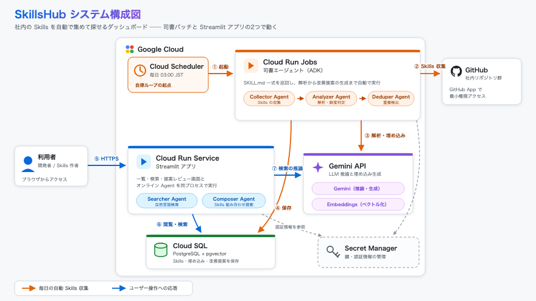

# SkillsHub — 社内 Skills ダッシュボード

> [DevOps AI Agent ハッカソン 2026](https://findy.notion.site/devops-ai-agent-hackathon-2026) 出展作品

社内に散在する AI エージェント用 Skills を自動収集し、検索・品質評価・改善提案まで一気通貫で行うダッシュボード。
AI エージェントが「司書」として Skills の鮮度を維持し続ける。

## アーキテクチャ



## 主な機能

- GitHub リポジトリから Skills を自動収集・分類
- 品質スコアリングと鮮度（fresh / stale / needs_update）の可視化
- 自然言語による Skills 検索
- AI による改善提案（diff 形式）と重複検出

## 技術スタック

| レイヤー | 技術 |
|---|---|
| フロントエンド | Streamlit |
| バックエンド | Python 3.12 / SQLAlchemy / Alembic |
| LLM / 埋め込み | Gemini（google-genai） / Vertex AI |
| データベース | PostgreSQL + pgvector |
| インフラ | Cloud Run / Cloud SQL / Secret Manager |
| CI/CD | Cloud Build |

## セットアップ

```bash
cp .env.example .env
docker compose up -d
uv sync
./scripts/migrate.sh
```

詳細は [docs/local-development.md](docs/local-development.md) を参照。

## ドキュメント

- [ローカル開発ガイド](docs/local-development.md)
- [デプロイ手順・インフラ構成](docs/deploy.md)
- [設計ドキュメント](docs/designs/overview/overview.md)

## ユーザーストーリー
### Skills開発を牽引するエンジニアの田中さん

AI活用を全社で推進する自社開発企業で、エンジニアの田中はチーム横断で使えるSkillsを精力的に作ってきた。しかし、作ったSkillsがどれだけ使われているか分からず、気づけば他チームがほぼ同じものを別リポジトリに作っていて落ち込んだ。SkillsHub導入後は、作成前に自然言語検索で類似Skillsを確認し、重複があれば統合提案をレビュー画面からワンクリックで採用する。車輪の再発明に費やしていた時間を、新しいSkillsの開発に充てられるようになった。また、似たようなSkillsを作っているメンバーにはissueのコメントを通じて声をかけ、互いのSkillsの研鑽が行えるようになった。

### 定例業務のSkills化を模索するエンジニア佐藤さん

佐藤は毎週の定例後、議事録の整理とタスクの振り分けをVSCodeとCopilotを使って手作業で続けていた。これらの業務をSkills化したいが、何から手を付ければよいか分からない。SkillsHubで「議事録を要約して担当者別のタスクに分けたい」と検索すると、他チームの議事録要約Skillが見つかり、実装の参考になる書き方までその場で把握できた。ゼロから設計する代わりに、既存Skillsを土台に自チーム向けの差分だけを作ればよくなった。

### AI活用ノウハウを横展開したいPM鈴木さん

PMの鈴木は、開発チームのAI活用事例を他チームにも広げたいが、各チームのSkillsがどのリポジトリにあるのか把握できずにいた。SkillsHubのダッシュボードを開けば、組織内のSkillsがタグと鮮度バッジ付きで一覧でき、stale なまま放置されたSkillsも一目で分かる。このチームのこのSkillsはうちでも使えるのでは、という具体的な提案を、実物を見ながらできるようになった。
