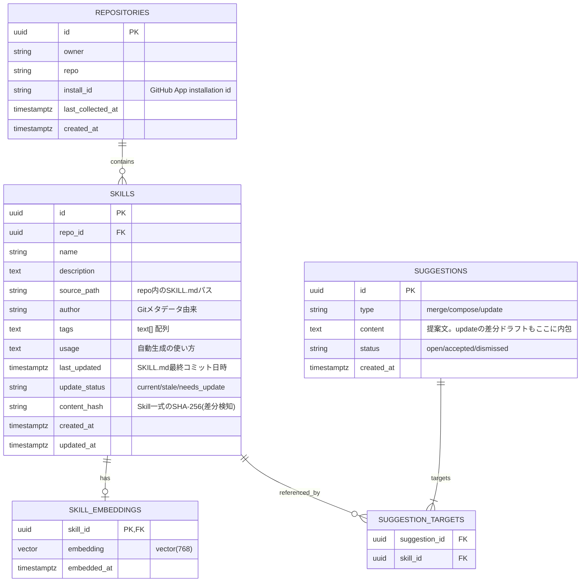

# Step 1 ER 図（確定版）

Step 1 で実際に作る 5 テーブルだけを定義する。完全版の ER 図は [総括のデータモデル](../overview/overview.md#データモデル) を参照。本書は overview から Step 1 スコープに絞り、[issue #11](https://github.com/t-devops-hackathon-2026/ai-agent/issues/11) のカラム取捨選択を反映したもの。テーブル名は複数形で統一する。

## リレーション

- `repositories ||--o{ skills` : 1 リポジトリに複数 Skill（`skills.repo_id`）
- `skills ||--o| skill_embeddings` : 1 Skill に 0/1 の埋め込み（`skill_id` が PK 兼 FK）
- `skills ||--o{ suggestion_targets` : Skill は複数の提案から参照される
- `suggestions ||--|{ suggestion_targets` : 1 提案が複数 Skill を指す（`compose` の多対多をブリッジ表で表現）

## overview の完全版 ER からの差分（Step 1 の取捨選択）

| 対象 | 決定 | 理由 |
|---|---|---|
| `usage_events` テーブル | 作らない | Step 3 |
| `skills.quality_score` / `quality_breakdown` | 作らない | Step 3 |
| `repositories.default_branch` | 削除 | Git Trees / Commits API は `HEAD` で既定ブランチに解決でき、列挙時に毎回取得できるため保存不要 |
| `repositories.status` | 削除 | error/disabled を画面で扱わないため。失敗は `last_collected_at`＋ログで足りる |
| `skills.freshness_status` | `update_status` に改名（値 `current/stale/needs_update`） | 「鮮度」より「更新の要否」が直球。`suggestions.type='update'` と対応 |
| `suggestions.diff` | 削除 | 用途は画面表示のみ。差分ドラフトは `content` に内包 |
| `suggestions.confidence` | 削除 | 提案をスコア順表示しない。閾値判定(0.88)は生成可否に使うだけで保存不要 |
| `repositories.install_id` | 残す | 画面⑤「今すぐ収集」で単一リポジトリのトークン発行に必要（discovery 往復を省ける） |
| `skills.content_hash` | 残す | 差分検知で未変更 Skill の LLM 解析・埋め込みをスキップ（コスト対策） |

## インデックス方針

- `skills(update_status)` / `skills(updated_at)` : 一覧・絞り込み用の通常インデックス
- `skill_embeddings` : `USING hnsw (embedding vector_cosine_ops)`（件数が少なく学習不要な hnsw 推奨）

## メモ

- テーブル名は複数形（`repositories` / `skills` / `skill_embeddings` / `suggestions` / `suggestion_targets`）で統一。FK カラム名は単数（`repo_id` / `skill_id` / `suggestion_id`）。
- `tags` は PostgreSQL の `text[]`。mermaid 表記の都合で型を `text`、配列であることをコメントで補記している。
- `suggestion_targets` の主キーは複合 `(suggestion_id, skill_id)` を想定（要 DDL 化時に確定）。
