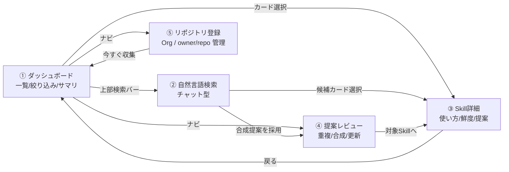
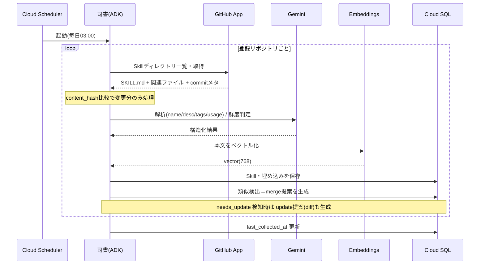
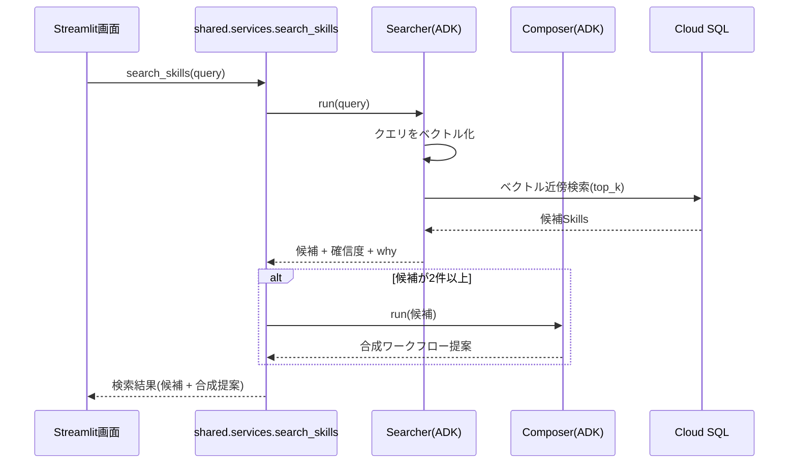
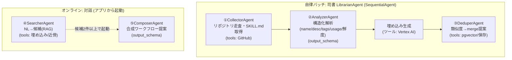
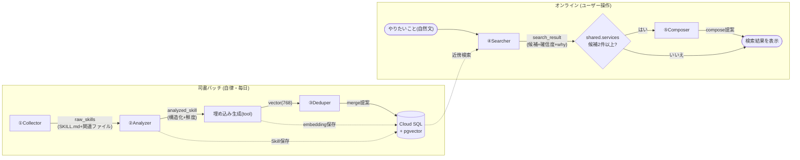

# Step 1 仕様書: Skill を集めて探せる・重複と陳腐化に気づける

全体像・技術スタック・インフラ構成は [総括](../overview/overview.md) を参照。本書は Step 1 で実装する範囲だけを定義する。

この仕様の動作デモ: [demos/step1/demo.html](../../../demos/step1/demo.html)（ブラウザで開ける。Step 間はデモ右上のリンクで行き来できる）

## このステップでできること

1. 司書エージェントが毎日自動で登録リポジトリを巡回し、Skill を収集・解析してカタログ化する。
2. ダッシュボードで全 Skill を一覧・絞り込み・サマリ表示できる。
3. 「やりたいこと」を自然文で入力すると、合致する Skill が確信度・推薦理由つきで見つかる。
4. Skill 詳細で説明・タグ・自動生成の使い方・鮮度を確認できる。
5. 重複している Skill（merge）、組み合わせると目的を達成できる Skill（compose）、陳腐化した Skill の更新案（update）の3種の提案を受け取り、採用/却下を記録できる。
6. 収集対象の Organization / リポジトリを画面から登録・即時収集できる。

このステップ単体で「散在 Skill を集めて可視化し、重複・陳腐化を自動で指摘し、合成・更新まで提案する」デモが成立する。

## 画面（Step 1 時点）

5画面すべてをこのステップで作る。完全版との違いは、品質スコア（Step 3）と利用状況（Step 3）、改善提案 improve（Step 2）が画面に現れない点。

各画面の Step 1 時点の内容:

- ダッシュボード: サマリカード（登録Skills数 / 重複候補数 / 要更新数 / 陳腐化注意数）、絞り込み（フリーワード・鮮度・タグ）、ソート（更新日）、Skillカード（鮮度バッジ・タグ・作者・取得元リンク）。
- 自然言語検索: チャットUIで候補最大3件を確信度・推薦理由つきで提示。候補が2件以上なら合成ワークフロー提案を併記。
- Skill詳細: 鮮度バッジ・タグ・説明・作者・取得元リンク・最終更新・使い方（自動生成）・open な提案（merge/compose/update）の承認/却下・GitHub issue への誘導リンク。
- 提案レビュー: open な Suggestion 一覧（merge/compose/update）、diff 表示、採用/却下。
- リポジトリ登録: 登録済み一覧、新規登録フォーム、「今すぐ収集」ボタン。

## シーケンス

### 司書による収集（バッチ・自動実行）

### 自然言語検索（ユーザー操作）

## ADKエージェント構成（Step 1: 5体＋司書オーケストレータ）

- オフライン司書は `SequentialAgent`（`Collector → Analyzer → Dedup`）。Collectorのリポジトリごとに Analyzer はリポジトリ内Skill単位で `LoopAgent`/並列化可。
- ADKの制約: `output_schema` を設定したエージェントは tools を使えない。そのため「構造化出力が要るもの（Analyzer/Composer）」と「ツールを叩くもの（Collector/Dedup/Searcher）」で役割を分けている。
- 各エージェントは結果を `output_key` で session state に書き、後段がそれを読む契約とする（構造化出力は `output_schema` / Pydantic で固定）。
- オンラインはアプリのリクエスト時に該当エージェントを `Runner` で起動。合成は Searcher→Composer を機械的に直列化せず、`shared.services` が検索候補を見て必要時に Composer を呼ぶ（Composer は構造化出力で tools を持てないため、制御をサービス層に置くと素直）。
- モデルは Gemini Flash 既定、重い推論（Composer）のみ Pro 系を使い分け。
- 鮮度 `needs_update` を検知した Skill には、鮮度判定パイプラインの一部として update 提案（diff）を生成する。

### Agentの流れ（データの受け渡し）

- 司書側は「収集→解析→埋め込み→重複検出」を Skill ごとに繰り返し、結果は逐次 Cloud SQL に永続化する（1件失敗しても他Skillは止めない）。
- オンライン側は `output_key`（`search_result` 等）をサービス層が受け取り、分岐や提案登録を制御する。
- 提案（merge/compose/update）は `SUGGESTION` に貯まり、提案レビュー画面で採用/却下する。

## アルゴリズム仕様

> 💬 鮮度判定のしきい値、重複検出のしきい値は現時点では暫定値であり、実データを見ながら調整する前提。

### 鮮度判定

コミット経過時間を主軸に、Analyzer（鮮度判定ステップ）が判定する。

| ステータス | 条件 |
|---|---|
| `current` | 最終更新が90日以内、かつ依存変更の兆候なし |
| `stale` | 最終更新が90日超〜180日、または依存記述が古い疑い |
| `needs_update` | 参照API/依存ツールの変更を検知（Analyzer が SKILL.md 内の参照先と既知の変更を突き合わせ） |

- しきい値（90/180日）は環境変数で調整可能にする。
- Step 3 で「利用回数」を加えた2軸判定に拡張する。

### 重複・類似検出

- pgvector cosine 類似度で近傍探索。`similarity = 1 - cosine_distance`。
- しきい値 0.88以上 を重複候補とし、`merge` 提案を生成（過検出回避のため高めに設定、環境変数化）。
- 自分自身・同一 `source_path` は除外。

### 提案の採用時挙動

- `merge`/`compose`: ステータスを `accepted` に更新する（記録のみ。GitHub への反映は作者が手元で行う）。
- `update`: diffを「適用済みドラフト」として記録し、対象Skillの `update_status` を `current` に戻す（実コミットは作者が手元で実施）。
- いずれも監査のため `accepted` 履歴（種別・対象・日時）を残す。ログインを設けないため記録は種別・対象・日時の3点とする。

## データモデル（Step 1 で作るもの）

`Repository` / `Skill` / `Skill_Embedding` / `Suggestion` / `Suggestion_Target` の5テーブルを作る。`Skill` の `quality_score` / `quality_breakdown` カラムは Step 3 で追加する。ER 図は [総括のデータモデル](../overview/overview.md#データモデル) を参照。
