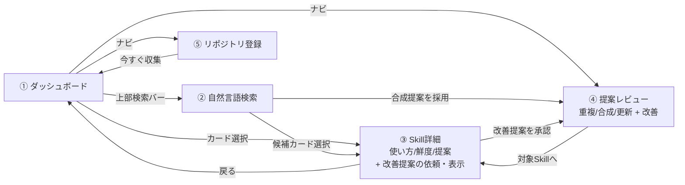
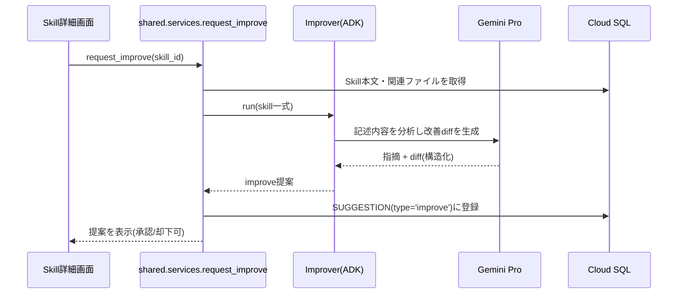

# Step 2 仕様書: Skill の改善提案（diff）を受け取れる

全体像は [総括](../overview/overview.md)、前提となる機能は [Step 1 仕様書](../step1/step1.md) を参照。本書は Step 2 で追加する範囲だけを定義する。

この仕様の動作デモ: [demos/step2/demo.html](../../../demos/step2/demo.html)（ブラウザで開ける。Step 間はデモ右上のリンクで行き来できる）

## このステップでできること

Step 1 の全機能に加えて、次ができるようになる。

1. Skill 作者が、自分の Skill に対する改善提案（improve）を diff 付きで受け取れる。
2. 改善提案は SKILL.md の記述内容の分析（説明の曖昧さ・トリガー記述の不足・入出力例や前提の欠落など）に基づいて生成される。
3. 提案レビュー画面・Skill 詳細画面で improve 提案を確認し、採用/却下を記録できる。

> 改善観点の定量化（品質スコアとしての採点・可視化）は Step 3 で行う。Step 2 では観点ごとの指摘と修正 diff の提示にフォーカスする。

## 追加するもの / 変更するもの

| 区分 | 内容 |
|---|---|
| エージェント | `ImproverAgent` を追加（オンライン系、`output_schema` で diff を構造化出力、モデルは Pro 系） |
| 画面: Skill詳細 | 「改善提案を依頼」ボタンと improve 提案の表示・承認/却下を追加 |
| 画面: 提案レビュー | type バッジに `improve` が加わる（一覧・diff 表示・採用/却下の仕組みは Step 1 のまま） |
| データモデル | 新テーブルなし。既存 `Suggestion` に `type='improve'` のレコードが加わる |

## 画面遷移（Step 2 時点）

Step 1 の遷移に、Skill 詳細から改善提案を起こす導線が加わる。

## シーケンス（追加分）

### 改善提案の生成（ユーザー操作起点）

## アルゴリズム仕様（追加分）

### 改善提案（improve）

- 分析観点（Step 1 の解析・Step 3 の採点と共通の3観点）:
  1. 説明の明確さ: 何をする Skill か一読で分かるか。
  2. トリガー精度: 「いつ使うか」の記述が具体的か。
  3. 注釈の充実: 入出力例・前提・制約の記載があるか。
- 観点ごとの指摘と、SKILL.md への具体的な修正 diff をセットで生成する。
- diff は `Suggestion.diff`（jsonb）に下書きとして保存し、提案レビュー画面で表示する。

### 提案の採用時挙動

- `improve`: ステータスを `accepted` に更新する（記録のみ。実コミットは作者が手元で実施）。監査用の履歴は Step 1 と同じ（種別・対象・日時）。
