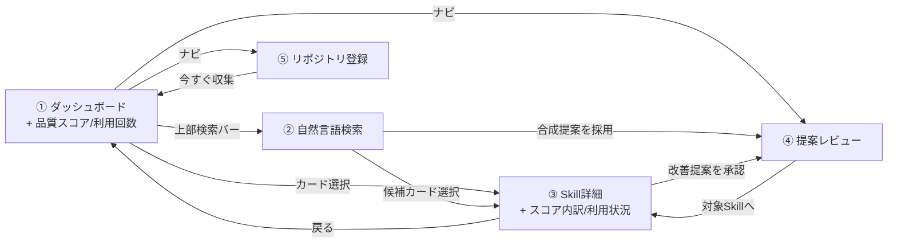
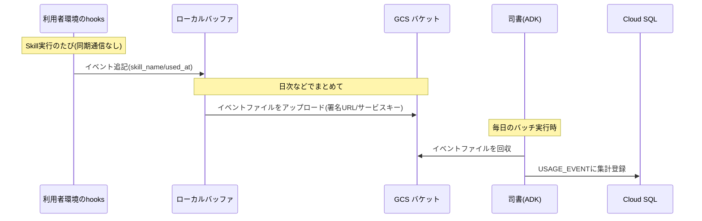
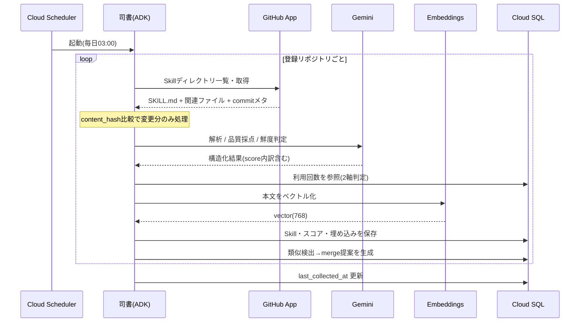

# Step 3 仕様書: 利用状況と品質スコアで Skill の価値を測れる

全体像は [総括](../overview/overview.md)、前提となる機能は [Step 1 仕様書](../step1/step1.md)・[Step 2 仕様書](../step2/step2.md) を参照。本書は Step 3 で追加する範囲だけを定義する。

この仕様の動作デモ: [demos/step3/demo.html](../../../demos/step3/demo.html)（ブラウザで開ける。Step 間はデモ右上のリンクで行き来できる）

## このステップでできること

Step 1・2 の全機能に加えて、次ができるようになる。

1. 各 Skill の利用回数が匿名で集計され、ダッシュボード・詳細画面で需要・人気として可視化される。
2. 司書が各 Skill を3観点で採点し、品質スコア（0-100）と内訳が表示される。
3. 鮮度判定がコミット経過時間＋利用回数の2軸になり、「古いが使われている＝優先手当て」「古く使われていない＝廃止候補」を区別できる。
4. 利用者は自分の環境に hooks を設定するだけ（オプトイン）で、利用回数の集計に参加できる。
5. Skill 詳細画面で SKILL.md や関連スクリプトなど、Skill 構成ファイルの中身をダッシュボード上で直接閲覧できる（リポジトリへ遷移しなくても内容を確認できる）。

## 追加するもの / 変更するもの

| 区分 | 内容 |
|---|---|
| 収集 | hooks による利用イベントの匿名・非同期収集（ローカルバッファ＋日次まとめ送信） |
| エージェント | `AnalyzerAgent` に品質採点ステップを追加（解析と同じ1回のLLM呼び出しに統合） |
| 鮮度判定 | コミット経過時間＋利用回数の2軸判定に拡張 |
| 画面: ダッシュボード | Skillカード・ソートに品質スコアと利用回数を追加 |
| 画面: Skill詳細 | 品質スコア内訳（3観点のバー表示）、利用状況（回数推移）、**Skill 構成ファイルの中身プレビュー**を追加 |
| 収集 | 司書が各 Repo から SKILL.md と関連ファイルの**本文**もまとめて取得・保存（構成ファイルプレビュー用） |
| データモデル | `Usage_Event` テーブルを追加。`Skill` に `quality_score` / `quality_breakdown` カラムを追加。`Skill_File` テーブルに `content` カラム（テキスト本文）を追加 |

## 画面遷移（Step 3 時点＝完全版）

画面遷移は Step 2 から変わらず、各画面の表示項目が増える。完全版の画面仕様は [総括の「完全版の画面」](../overview/overview.md#完全版の画面) を参照。

## シーケンス（追加・拡張分）

### 利用記録の収集（hooks → 司書バッチ回収）

GCS アップロード回収方式（推奨案）の場合。

### 司書による収集（Step 1 のシーケンスに採点と2軸鮮度判定を追加）

## 利用記録の収集方式

プライバシーと負荷に配慮し、匿名・オプトイン・最小データに限定する。

- 収集範囲は最小: 「どの Skill を使ったか」（`skill_name` / `used_at`）のみ。匿名の回数集計であり、Skill の実行内容や入出力は収集対象外。
- オプトイン: 各利用者が自分の環境で hooks を設定したときだけ送信される。使いたい人だけが設定すればよい。
- 送信方式（負荷・受け口への配慮）: Skill 実行のたびに同期 HTTP を叩く方式は、通信オーバーヘッドと受け口の常時開放という難点がある（Skill によっては高頻度実行もありうる）。そこでローカルにイベントをバッファし、日次などでまとめて送る非同期方式を基本とする。これにより実行のホットパスから通信を外し、公開する受け口も最小化する。
- 収集口の信頼方式（本ステップ着手時に確定）: ダッシュボード自体はログイン不要だが、収集口は受け口を絞る方向を推奨する。候補は次の3つ。
  1. GCS へアップロード回収（推奨）: 収集APIを公開せず、hooks はサービスキー/署名URLで GCS にイベントファイルを投下、司書バッチが回収する。受け口の攻撃面が最小。
  2. 共有トークン付き収集API: 軽量な収集APIを立て、配布した共有トークンで受理。実装は素直だが受け口を常時公開する。
  3. GitHub トークンでのゲート: org メンバーに絞りたい場合のみ、hooks の GitHub トークンを収集側で検証する。匿名集計が前提のため通常は過剰。
- 集計結果は `Usage_Event` に蓄積する。

## アルゴリズム仕様（追加・拡張分）

### 品質スコア（0-100）

> 💬 評価観点・重み・算出式は暫定値。スコアの納得感はユーザーの信頼に直結するため、実 Skill で検証しながら優先して詰める。

Analyzer（採点ステップ）が3観点を各0-100で採点し、加重平均で総合スコアを出す。観点は Step 2 の改善提案と共通。

- 説明の明確さ `description`（重み0.4）: 何をするSkillか一読で分かるか。
- トリガー精度 `trigger`（重み0.35）: 「いつ使うか」の記述が具体的か。
- 注釈の充実 `annotation`（重み0.25）: 入出力例・前提・制約の記載。
- `quality_score = round(0.40*d + 0.35*t + 0.25*a)`。内訳は `quality_breakdown` に保存し詳細画面で可視化。

品質スコアは Step 2 の改善提案（improve）の優先度付けにも使う（スコアの低い観点から改善する）。

### 鮮度判定の2軸化

Step 1 の「コミット経過時間」に「利用回数」を加えた2軸で判定する。

- 古くても利用が多い Skill → 価値が高いので優先的に手当て（改善提案の優先度を上げる）。
- 古くて利用も少ない Skill → 廃止候補として扱う。

## Skill 構成ファイルのプレビュー

司書が同期時に SKILL.md と関連ファイル（参照スクリプト・設定 YAML・JSON 等）の本文を取得し、`Skill_File.content` に保存する。Skill 詳細画面ではファイル一覧の各行をクリックするとその場で本文プレビューを展開でき、利用者はリポジトリへ遷移しなくても中身を確認できる。

- 取得対象は SKILL.md と、SKILL.md が参照するパス配下の関連ファイル。バイナリ・大容量ファイル（既定 100KB 超）は本文を保存せずファイル名のみ表示する。
- 表示はシンタックスハイライト不要のテキスト等幅表示で十分（差分 diff と同じ見た目）。
- 機密情報の混入リスクに配慮し、登録時に「公開リポジトリのみ」を前提とする。プライベートリポジトリ対応時には別途マスキング方針を検討する。

## データモデル（Step 3 で追加するもの）

- `Usage_Event` テーブルを追加（`skill_id` / `used_at`。匿名・回数集計）。
- `Skill` に `quality_score`（int, 0-100）と `quality_breakdown`（jsonb）カラムを追加。
- `Skill_File` に `content`（text, nullable）と `size_bytes`（int）カラムを追加。大容量・バイナリは `content = NULL`。
- ER 図は [総括のデータモデル](../overview/overview.md#データモデル) を参照。
